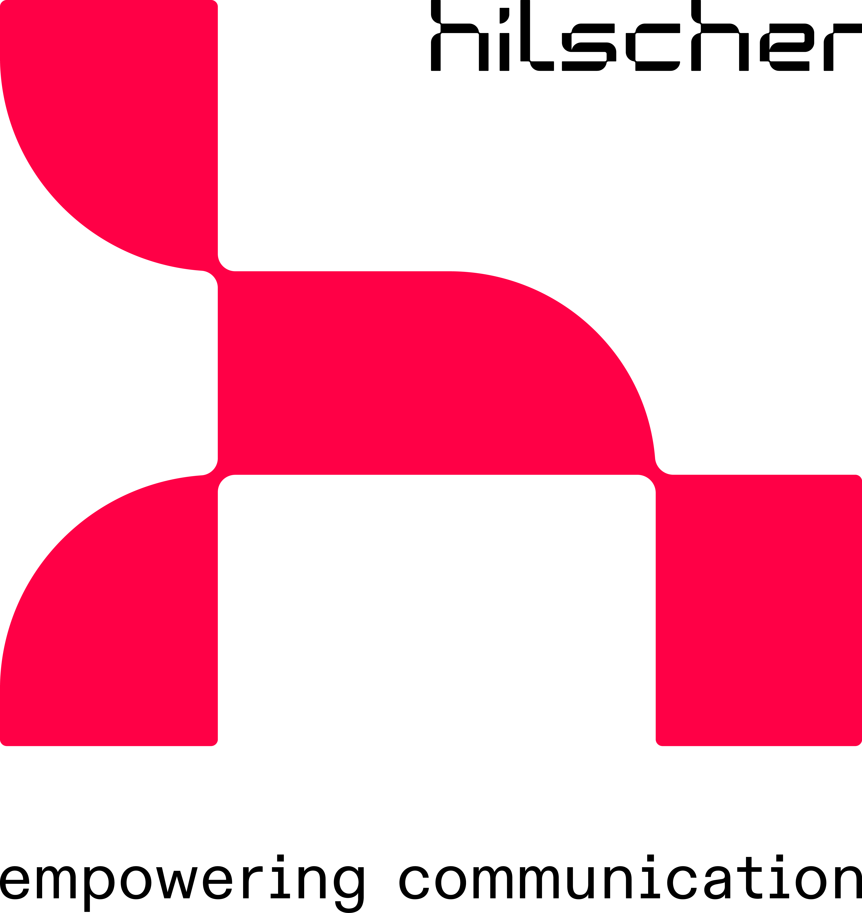

# netFIELD - Moving container-based IoT Intelligence towards the Edge
## netFIELD Cloud support for devices running Linux

netFIELD Cloud, as part of the netFIELD offerings, is made to orchestrate container-based IoT Intelligence in Edge devices remotely.

The end-to-end communication is based on Microsoft [Azure IoT](https://docs.microsoft.com/en-us/azure/iot-fundamentals/iot-introduction) featuring a device deployable [runtime](https://github.com/Azure/iotedge) and a hosted logic for remote servicing. Whereas the Azure IoT relies on [docker](https://www.docker.com/) container technology.

netFIELD Cloud delivers all the necessary infrastructure to spread intellectual property to the Edge from a central presence. And the Advantage for users is that they can focus on just developing their software and manage these workload rollouts to the devices in minutes.

### Installation Script

The Linux bash installation script hereunder adds/removes netFIELD support for a platform running native Linux such as Ubuntu, Debian, Raspbian, or even [YOCTO](https://www.yoctoproject.org/) project-based ones.

During the execution, it is registering(onboarding)/unregistering(offboarding) the calling platform to/from a given netFIELD Internet presence.

#### Installed Components

The script installs the following Linux standard tools and services during execution (if not found installed already)

 - curl (for installation only)
 - jq (for installation only)
 - openssl
 - bridge-utils
 
The script installs the following 3rd party packages during execution (if not found installed already)
  
 - Azure IoT Edge [Runtime](https://github.com/Azure/azure-iotedge/tags)(version 1.2.x) 
   - registering the services aziot-edged.service, aziot-keyd.service, aziot-identityd.service, aziot-certd.service for auto-start
 - docker-ce (moby-engine) (version 20.10.x)
   - the creation of a separate Unix socket for the Azure IoT-Edge controlled docker daemon
   - registering service iotedge-docker.service for auto-start

For the registering/unregistering process, the installed logic on the netFIELD Internet presence needs to be of a version

 - 3.1.0 or higher

The script neither installs/modifies Linux kernel modules nor is it touching any software components/modules/applications outside the scope of getting the services "Azure IoT Edge Runtime" and "docker-ce" to a running state.

Furthermore, the script does not install any graphical user interface, desktop, components with that the Linux OS itself can be maintained or setup across. These installations remain the task of the Linux core system's capabilities and its administrator. 

We recommend invoking the script on fresh Linux installations since any additional Linux software installed before running the script may increase the chance that subcomponents required and installed during the installation process could fail.

#### Supported Linux Distributions

The installation script reads the Linux distribution it was invoked on from file `/etc/os-release.` Its value `ID` is used in the install process to determine the correct [Azure IoT Edge Runtime](https://docs.microsoft.com/en-us/azure/iot-edge/support) package to install.

The installations on the following distributions have been successfully tested:

 - Ubuntu (amd64, armhf, arm64)
   - 18.04
   - 20.04
 - Debian (amd64, armhf, arm64)
   - 10
   - 11
 - Raspbian (armhf, arm64)
   - 10
   - 11
 
Make sure your distribution in use (call `cat /etc/os-release` and check value `ID`) matches any of the above-stated versions. If this is not the case, an installation will fail due to a missing "Azure IoT Edge Runtime" install package.

Other distributions may be supported but require modifying the script (e.g., bypassing the distribution check, other distribution versions). Linux and bash file/shell script programming skills are then required.

The script always calls the latest "Azure IoT Edge Runtime" install package available on Microsoft's server. A successful installation cannot be guaranteed if the installer was updated recently and is untested.

**NOTE:** SELinux will be set by the script to mode "permissive" on [rpm](https://en.wikipedia.org/wiki/RPM_Package_Manager) based systems in order let the "Azure IoT Edge Runtime" work correctly.

#### Minimum System Requirements and Resources

Make sure the following components exist on your platform for a successful installation

 - apt, default package manager
 - systemd, init system, and session manager

When the "Azure IoT Edge Runtime" is connecting to the cloud for the first time, it automatically pulls two core containers onto the platform:

* azureiotedge-hub
* azureiotedge-agent

The containers consume a significant amount of the platform's RAM. Therefore, we recommend using the install script on platforms with at least 1GByte of RAM.

### Cloud Front-end

The cloud front-end (called portal in other contexts) is a web HMI used to manage, maintain, and configure onboarded platforms and the application containers. The front-end has no intelligence and always relies on the back-end services.

The default management front-end's URL is [netFIELD](https://netfield.io) as used by the script if not configured otherwise.

Since netFIELD utilizes instances, the URL may vary per customer-specific configurations, so we've provided a script parameter to reflect this. Those URLs can be obtained by Hilscher sales personnel if needed.

For more information about netFIELD instance and customization, get in touch with your local Hilscher sales representative or read on with netFIELD [Terms of Use](https://netfield.io/termsOfUse).

### Cloud Back-end

The cloud back-end (called platform in other contexts) is the heart of any netFIELD instance. It regulates tasks like device management, key management, data reception, distribution, and much more. It is the front-end's anchor and communication partner.

The script communicates with the back-end instance over [APIs](https://api.netfield.io/v1/documentation). The script requests the corresponding back-end URL from the front-end URL configured.

### Authentication

The script authenticates against the cloud back-end using unique credentials. Two authentication methods are supported:

* key based
* username/password-based

Both - a key and a user - have permissions in the context of access control. The cloud instance administrator typically assigns those rights.

Make sure the following permissions have been granted for successful execution:

* "Create or delete a device (permissions: createDevices,deleteDevices)" 
* "Onboard or offboard a device (permissions: onboardedDevices,offboardedDevice"
* "View device details (permission: viewDeviceDetails)"

### Installation

Download the script [netfield-extension-linux-installer.sh](netfield-extension-linux-installer.sh) and make sure it has execution permission on the device.

Calling the script needs administrative rights either when called as user `root` or with `sudo.` 

Script parameters are passed to it as inline arguments. The usage is `sudo netfield-extension-linux-installer.sh <options> onboard|offboard`

The field <options> may contain single or multiple instructions as follows

* `-a | --apikey <value>`, authentication method A: <value> equals to an API key with correct authorization permissions.
* `-u | --username <value>`, alternative authentication method B, part 1: <value> equals a username (typically named account) with correct authorization permissions.
* `-p | --password <value>`, alternative authentication method B, part 2: <value> equals the password of the given user/username (account).
* `-i | --instance <value>`, the `<value>` represents the cloud front-end instance URL (without https://) the script shall link the device to. Defaults to `netfield.io` if not specified.
* `-m | --manifest` lets the cloud back-end automatically execute the cloud deposited device manifest after device onboarding. A deployment manifest regulates which default device services and modules are to be installed
* `-v | --verbose` outputs detailed information for debugging purposes about the script's activities during execution

The given `<value(s)>` are treated as private and just used temporarily during the script's execution. None of the given information or parts of the values are stored anywhere on the device.

The arguments `onboard|offboard` decide whether the device is made known (onboard) or unknown (offboard) in the cloud back-end.

#### Transaction Informations

The script uses the working file `/etc/netfield.io` to keep track of the device's status in the cloud back-end instance. It contains information such as

* device id
* serial number
* connection string
* shared access key
* instance

Never delete the working file while the device is in status onboarded. Else the script gets out of synch with the device status administered in the cloud back-end instance, and post processes like device offboarding or re-onboarding may fail.

Also, the Azure IoT Edge runtime has a similar working file `/etc/aziot/config.toml`. Never delete this file while the device is in an onboarded state.

#### Installation Problems

In a typical Linux, installing a simple package results in various subordinate installation processes of related software and dependencies. If any of these installations fails, the relevant process outputs the potential error source. 

An error indication does not necessarily mean the fail's root cause is the netFIELD install script itself. A typical error scenario could, for example, be an output like:
```  
  Processing triggers for aaa-bbb (xx.yy.zz) ...
  Errors were encountered while processing:
     ccc-ddd-eee
  E: Sub-process /usr/bin/dpkg returned an error code (1)
```
The script stops executing in this case and is exiting. You see a component `ccc-ddd-eee` could not be installed properly in a post-installation process of the component `aaa-bbb.` You also see that the root cause is not the script but a subcomponent.
  
The primary goal for analyzing such a problem should be to identify its root cause yourself before contacting the Hilscher support team at https://www.hilscher.com/support/contact/. 
  
For the example above, narrow down the problem by calling `apt install ccc-ddd-eee` manually. If it fails, you can dig into details and search on the Internet if others have the same problem with this component. 
  
Be aware that Hilscher, in nearly 100% of cases described above, cannot provide support if there is suspicion that any of your Linux components or its installer is broken.
  
**NOTE:** We are not supporting general questions about Linux, Azure IoT Edge, Docker, or Non-Hilscher containers since they are of type 3rd party and maintained by the community.
  
#### Examples
##### Onboard a Device
```
sudo netfield-extension-linux-installer.sh -a <apikey> onboard
```
```
sudo netfield-extension-linux-installer.sh -u <username> -p <password> onboard
```
```
sudo netfield-extension-linux-installer.sh -u <username> -p <password> -i xxx.netfield.io onboard
```
##### Offboard a Device
```
sudo netfield-extension-linux-installer.sh -a <apikey> offboard
```
```
sudo netfield-extension-linux-installer.sh -u <username> -p <password> offboard
```
```
sudo netfield-extension-linux-installer.sh -u <username> -p <password> -i xxx.netfield.io offboard
```

### Azure IoT Edge Docker Daemon

The script configures the "Azure IoT Edge Runtime" controlled docker daemon to listen to the UNIX socket `unix:///run/iotedge-docker.sock`. This additional Docker daemon enables dual Docker daemons to run in parallel in contrast to the one standard Docker daemon, usually listening to socket `unix:///var/run/docker.sock`.

Nevertheless, the well-known cli tool [docker](https://docs.docker.com/engine/reference/commandline/cli/) can be used in conjunction with the Azure IoT Edge docker daemon. This needs just passing the correct socket to it as argument `docker -H unix:///run/iotedge-docker.sock <command>`.

For better usability an alias can be defined like `alias docker-iotedge="docker -H unix:///run/iotedge-docker.sock"` and then calling `docker-iotedge <command>` instead.

### Remote Accessing/Port Forwarding

A netFIELD cloud front-end supports

* remote web sessions to a specific single configurable ip address and port that is reachable within an onboarded device's network scope
* configuration of a set of ip addresses and ports within an onboarded device's network scope being forwarded to remote IP locations over the netFIELD cloud back-end API

After the first device onboarding process, the device will deny any aforementioned remote functions. To generally enable them, modify the file `/etc/gateway/settings.json` by changing the value in the key `"remote-access"` from value "off" to value "on." A reboot of your device may be required to take effect.

### Licenses

This software is licensed under the LICENSE.txt file information stored in the project's source code repository.

"Azure IoT Edge" runtime is licensed under these [terms](https://github.com/Azure/azure-iotedge/blob/master/LICENSE)

### Trademarks

"netFIELD" is a trademark of Hilscher.

"Microsoft" and "Azure IoT Edge" are trademarks of the Microsoft group of companies. 

Copyright (c) Hilscher Gesellschaft fuer Systemautomation mbH. All rights reserved. 

[](http://www.hilscher.com)  Hilscher Gesellschaft fuer Systemautomation mbH www.hilscher.com

  
### develop * deploy * orchestrate


